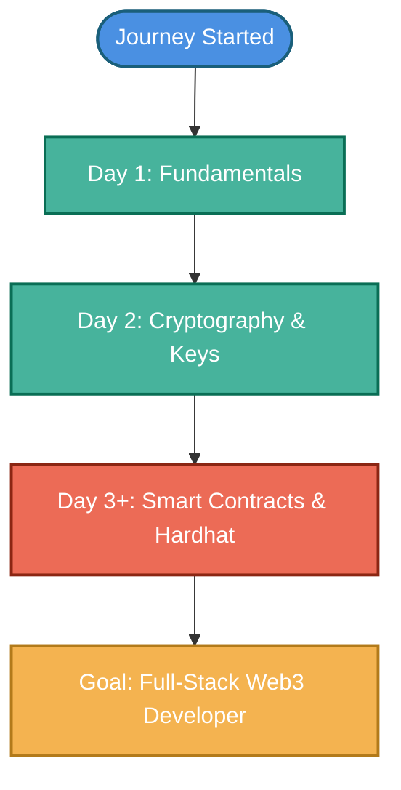

# 🚀 My Blockchain Journey

<div align="center">
  
  
  
</div>

---

### 👋 Hi, I'm **Maithili**

Welcome to my Blockchain learning repository! I created this space to document my step-by-step progress as I transition into a full-stack **Blockchain Developer**. Rather than just watching tutorials, I'm focusing on building hands-on projects, deploying smart contracts, and mastering cryptographic fundamentals.

---

## 🎯 The Ultimate Goal

> "Mastering decentralized systems to build secure, transparent, and user-centric Web3 solutions."

- [ ] 💻 **Master Solidity & Smart Contracts:** Write clean, optimized, and secure code.
- [ ] 🏗️ **Build Full Stack DApps:** Connect decentralized smart contracts with modern frontend UIs.
- [ ] 🔐 **Deep-dive into Web3 Security:** Learn auditing, vulnerability mitigation, and gas optimizations.
- [ ] 🚀 **Land a Blockchain Developer Role:** Build a robust portfolio of real-world decentralized projects.

---

## 🛠️ Tech Stack & Ecosystem

Here are the tools, libraries, and frameworks I am actively learning and using:

| Category | Technologies & Tools |
| :--- | :--- |
| **Smart Contracts** |   |
| **Frontend Integration** |    |
| **Backend & Tools** |    |

---

## 🗺️ Interactive Learning Journey

Explore my daily learning logs by expanding the sections below.



<details>
<summary><b>📚 Day 1: Blockchain Core Concepts (Completed ✅)</b></summary>

During my first day, I focused on understanding the underlying structure of decentralized networks:
- **What is Blockchain?** Chain of blocks linked by hash values.
- **Decentralization:** Peer-to-peer distribution eliminating single points of failure.
- **Distributed Ledger:** Shared and synchronized digital database across multiple sites.
- **Blockchain vs. Traditional Database:** Read/Write/Append-only vs. CRUD (Create, Read, Update, Delete) permissions.
- **Cryptographic Hashing:** One-way function to transform any input into a unique, fixed-size string of characters.
- **Immutability:** Once a block is committed, changing it requires recalculating every block after it.
- **Use Cases:** Supply chain, financial services, digital identity, voting systems.
</details>

<details>
<summary><b>📚 Day 2: Cryptography & Identity (Completed ✅)</b></summary>

I dived deeper into the mathematical and cryptographic underpinnings of identities on-chain:
- **Asymmetric Cryptography:** The link between Private Keys and Public Keys.
- **Wallet Address:** A unique identifier derived from the public key, representing destinations for transactions.
- **Seed Phrase (Mnemonic):** A sequence of words representing a master private key to recover accounts.
- **Digital Signatures:** Proof of ownership and authentication for transaction verification without revealing private keys.
</details>

---

## 📂 Project Showcases

Here are the projects built throughout this learning journey:

| Project | Description | Tech Used | Code Links | Live Demo |
| :--- | :--- | :--- | :--- | :--- |
| **Hello Blockchain** | Introduction to basic Solidity smart contract deployment. | Solidity | [📂 Contracts](file:///c:/Users/DELL/OneDrive/Desktop/blockchain-journey/contracts) | 🚫 *No UI (Contract-only)* |
| **Student Record Contract** | A smart contract to register and retrieve student records securely. | Solidity | [📂 Contracts](file:///c:/Users/DELL/OneDrive/Desktop/blockchain-journey/contracts) | 🚫 *No UI (Contract-only)* |
| **[Wallet UI](file:///c:/Users/DELL/OneDrive/Desktop/blockchain-journey/mini-projects/wallet-UI)** | A premium, minimalist blockchain wallet UI featuring dark/light mode toggle, balance mesh gradients, and fully responsive CSS layouts. | HTML, CSS | [📂 Folder](file:///c:/Users/DELL/OneDrive/Desktop/blockchain-journey/mini-projects/wallet-UI) \| [📖 README](file:///c:/Users/DELL/OneDrive/Desktop/blockchain-journey/mini-projects/wallet-UI/README.md) | [🚀 Live Demo](https://maithali.github.io/blockchain-journey/mini-projects/wallet-UI/) |
| **[Password Hasher](file:///c:/Users/DELL/OneDrive/Desktop/blockchain-journey/mini-projects/password-Hasher)** | A sleek, real-time client-side hashing app utilizing the native Web Crypto API to output SHA-256 hashes instantly. | HTML, CSS, JS | [📂 Folder](file:///c:/Users/DELL/OneDrive/Desktop/blockchain-journey/mini-projects/password-Hasher) \| [📖 README](file:///c:/Users/DELL/OneDrive/Desktop/blockchain-journey/mini-projects/password-Hasher/README.md) | [🚀 Live Demo](https://maithali.github.io/blockchain-journey/mini-projects/password-Hasher/) |

---

## 📈 Repository Structure

Expand below to see the organized workspace structure of this repository.

<details>
<summary><b>🔍 View Repository Tree</b></summary>

```text
Blockchain-Journey/
│
├── contracts/
│   ├── HelloBlockchain.sol
│   └── StudentRecord.sol
│
├── mini-projects/
│   ├── password-Hasher/
│   │   ├── index.html
│   │   └── README.md
│   │
│   └── wallet-UI/
│       ├── index.html
│       ├── styles.css
│       └── README.md
│
└── README.md
```
</details>

---

## 🌱 Why This Repository?

This workspace is a living logbook of my progress. Every contract, configuration, and UI project here represents real concepts I've explored and implemented to prepare for a professional career in decentralized applications (dApps).

---

## 📌 Let's Connect!

Feel free to reach out, share advice, or collaborate on Web3 ideas!

<div align="left">
  <a href="https://www.linkedin.com/in/maithali-gharde/" target="_blank">
    
  </a>
  <a href="https://github.com/Maithali" target="_blank">
    
  </a>
</div>

---
<div align="center">
  <b>⭐ If you find this repository helpful, consider leaving a star! ⭐</b>
</div>
