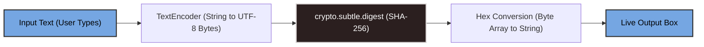
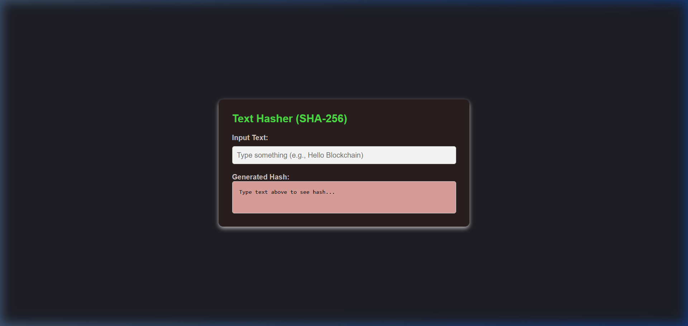
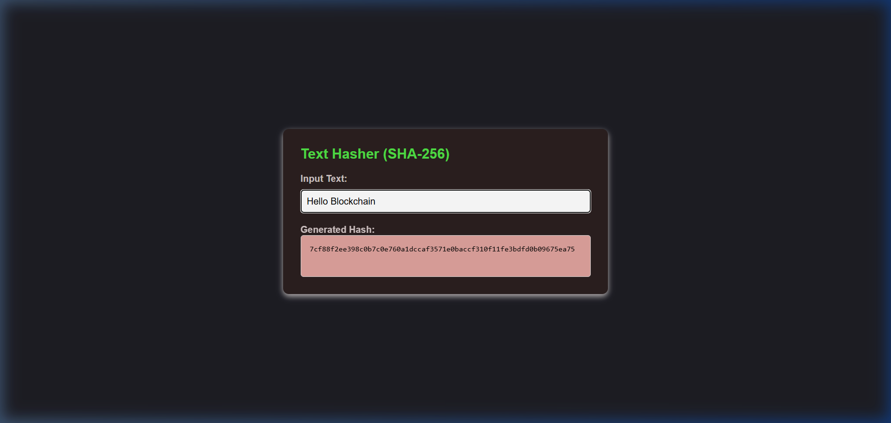

# 🔒 Real-Time Text Hasher (SHA-256)

A sleek, lightweight, single-page web application that computes **SHA-256 cryptographic hashes** in real-time as you type. Built with standard HTML, custom dark mode styling, and zero external dependencies.

---

## ⚡ How It Works

Here is a simplified view of the cryptographic pipeline:



---

## 🛠️ Features

* **Instant Updates:** Hashing is triggered on every keystroke (`input` event listener).
* **Pure Client-Side:** No server requests are made. Your inputs never leave your browser.
* **Native Cryptography:** Uses the modern browser's built-in [Web Crypto API](https://developer.mozilla.org/en-US/docs/Web/API/Web_Crypto_API).

---

## 📸 Screenshots

Here is the Text Hasher in action:

| Initial (Empty) State | Active Hashed State |
| :---: | :---: |
|  |  |

---

## 🔍 Code Breakdown

Click on the sections below to reveal explanations of the underlying code:

<details>
<summary><b>1. Text Encoding (String to Bytes)</b></summary>

The cryptographic hashing function requires the input in raw bytes, not as a JavaScript string. We use the browser-native `TextEncoder` to translate the string into UTF-8 representation:
```javascript
const encoder = new TextEncoder();
const data = encoder.encode(text); // Returns a Uint8Array
```
</details>

<details>
<summary><b>2. Crypto Digest (SHA-256)</b></summary>

We use the asynchronous `crypto.subtle.digest` API to run the SHA-256 hash function. This uses the hardware-accelerated capabilities of the device:
```javascript
// Hash the data using the SHA-256 algorithm
const hashBuffer = await crypto.subtle.digest('SHA-256', data); // Returns an ArrayBuffer
```
</details>

<details>
<summary><b>3. Byte-to-Hex conversion</b></summary>

The output of the hashing algorithm is a raw `ArrayBuffer`. We convert these bytes into a standard 64-character hexadecimal representation:
```javascript
// Convert the ArrayBuffer to a Hexadecimal string
const hashArray = Array.from(new Uint8Array(hashBuffer));
const hashHex = hashArray.map(b => b.toString(16).padStart(2, '0')).join('');
```
* **`new Uint8Array(hashBuffer)`**: Wraps the raw buffer into a typed array of numbers (0-255).
* **`b.toString(16)`**: Converts each byte to its base-16 (hex) equivalent.
* **`padStart(2, '0')`**: Formats single digit hex values (like `f`) to double digits (`0f`).
* **`join('')`**: Joins all parts together into a continuous hash string.
</details>

---

## 🚀 How to Run

1. Clone or download this project folder.
2. Locate the [index.html](file:///c:/Users/DELL/OneDrive/Desktop/blockchain-journey/mini-projects/password-Hasher/index.html) file.
3. Simply double-click the file to open it in any modern web browser. No installation or build steps are needed!
