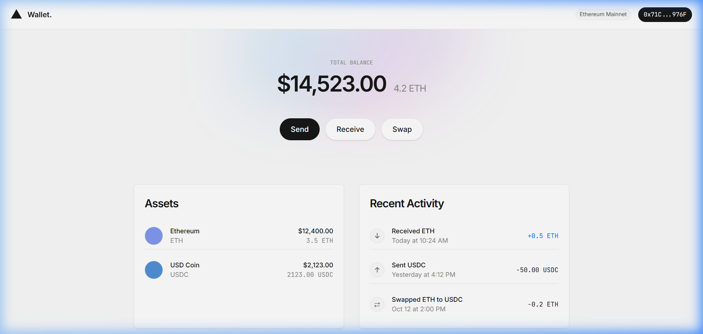
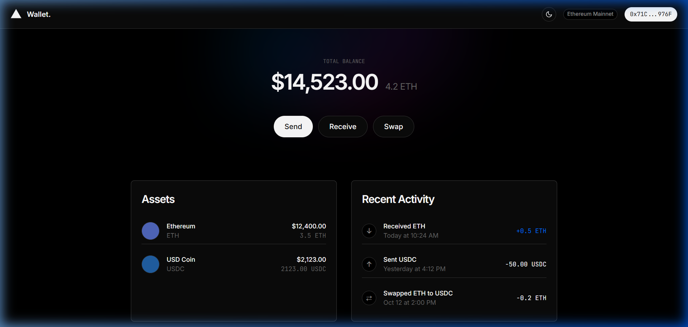

# Vercel-Inspired Blockchain Wallet UI

A premium, minimalist blockchain wallet UI built using only pure **HTML** and **CSS** (no frameworks, no Tailwind). The design system is strictly modeled after the Vercel-inspired design principles outlined in [DESIGN.md](../../DESIGN.md), featuring a clean, dark-mode/light-mode duet style with technical accents.

## 📸 Screenshots

### Light Mode


### Dark Mode


---

## 🎨 Design System Implementation

Following the Vercel design system specifications:
* **Colors**: High-contrast, near-black primary ink (`#171717`) for typography and main actions, structured against pure white cards (`#ffffff`) on a soft-canvas (`#fafafa`) background.
* **Decorative System**: The signature multi-stop mesh gradient (cyan-blue-magenta-pink) is implemented as a subtle, soft-blurred backdrop behind the main balance display.
* **Typography**:
  - **Inter**: Geometric Sans-serif used for displays, headlines, buttons, and normal labels. Large displays feature aggressive negative tracking (`-2.4px`).
  - **JetBrains Mono**: Used for technical data, transaction indicators, wallet addresses, and code-like metrics (e.g., token amounts, block metadata).
* **Elevation**: Avoids heavy material shadows. Elevation uses stacked subtle shadows with inset hairline boundaries (`1px solid #ebebeb`) to sit cleanly on the canvas.
* **Shapes**: Utilizes a strict 100px rounded pill shape (`var(--rounded-pill)`) for marketing and transactional action buttons.

---

## ⚡ Features

1. **Top Navigation Bar**: Sticky header featuring a geometric logo mark, network indicator badge ("Ethereum Mainnet"), a truncated wallet address badge (`0x71C...976F`), and an interactive **Light/Dark Mode toggle button**.
2. **Dashboard Hero Band**: 
   - Clean, sentence-case period-terminated typography.
   - Distinct balance display ($14,523.00 USD paired with 4.2 ETH).
   - Mesh gradient overlay to add premium depth.
   - Primary action buttons: `Send` (Ink Pill), `Receive` & `Swap` (Secondary White/Bordered Pills).
3. **Double Column Content Grid**:
   - **Assets Card**: Displays cryptocurrency tokens (ETH, USDC) with custom-colored placeholder icons, token values, and modern layout structures.
   - **Recent Activity Card**: Lists historical wallet activities (incoming, outgoing, swaps) with status icons, relative timestamps, and mono-spaced token change text.
4. **Responsive Layout**: Adapts gracefully to mobile devices, switching to stacked grids, centring hero elements, and inflating touch targets where appropriate.

---

## 📂 Project Structure

```bash
mini-projects/wallet-UI/
├── index.html       # Semantic HTML layout
└── styles.css       # Raw CSS rules containing Vercel design system variables
```

---

## 🚀 How to Run

Since the project uses raw HTML and CSS with standard Google Fonts, you can open and run it instantly.

### Option 1: Direct File Open
Simply double-click the [index.html](index.html) file or drag it into any modern web browser.

### Option 2: Live Server (Development)
If you have Python or Node installed, you can serve it locally for hot reload or local testing:

**Python**:
```bash
python -m http.server 8000
```
Then visit `http://localhost:8000`.

**Node (http-server)**:
```bash
npx http-server .
```
Then visit the output port.
