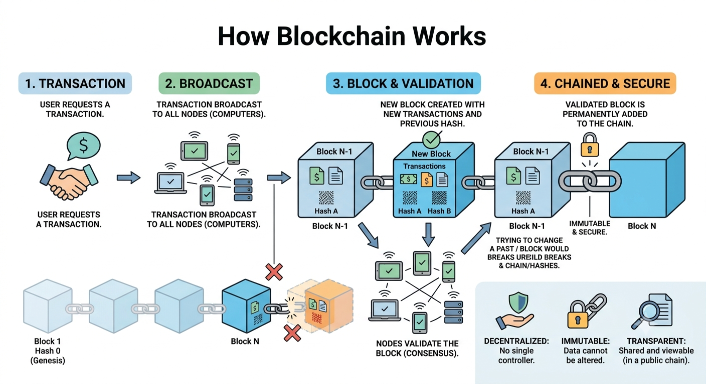

# 🚀 Topic 1: What is Blockchain?

Imagine a **magic notebook** shared by thousands of people. Every time someone writes a new line in their notebook, it magically appears in everyone else's notebook at the exact same time.

Here is the catch: **Once you write something in this notebook in pen, it can NEVER be erased or changed.** That’s a blockchain! It is a digital, shared, and unchangeable record of transactions.

---

## ✨ The 3 Superpowers of Blockchain (Remember "D.T.I.")

1. **D - Decentralized (No Boss):** There is no central authority (like a bank or government) controlling it. The power is spread across a massive network of computers (called _nodes_).
2. **T - Transparent (Open to All):** Anyone on the network can see the history of transactions. No secrets!
3. **I - Immutable (Unhackable/Unchangeable):** Once data is locked into a block, you cannot alter it without changing every single block that comes after it (which is practically impossible).

---

## 🛠️ How Does It Actually Work? (The Step-by-Step)



1. **The Request:** Someone requests a transaction (e.g., "Send 1 Bitcoin to Alice").
2. **The Block:** The request is packaged into a "block" with other pending transactions.
3. **The Broadcast:** This block is sent to every computer (node) in the network.
4. **The Validation:** The computers solve complex math puzzles to verify the transaction is legit.
5. **The Chain:** Once approved, the block is permanently chained to the previous block.
6. **Success!** The transaction is complete.

---

## 🗺️ Visualizing the Chain (Diagram)

Think of it as physical blocks linked by unbreakable chains. Each block contains data, its own unique fingerprint (Hash), and the fingerprint of the block before it.

```text
  [ BLOCK 1 ]  ========>  [ BLOCK 2 ]  ========>  [ BLOCK 3 ]

 📄 Data: Genesis       📄 Data: Tx #45          📄 Data: Tx #89
 🪪 Hash: 000A          🪪 Hash: 000B            🪪 Hash: 000C
 🔗 Prev: NULL          🔗 Prev: 000A            🔗 Prev: 000B

*If a hacker changes Block 2, its Hash changes. Block 3 will no
longer recognize it, breaking the whole chain!*
```
